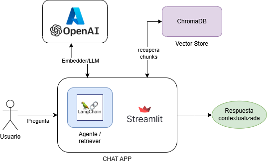

# Evaluation and Improvement of Context in Large Language Models (LLMs)

## Objective

The main objective of this work is to develop a **Retrieval-Augmented Generation (RAG)** system that enables interaction with the **Spanish Constitution**. This system aims to improve the precision and relevance in text generation by large language models (LLMs), integrating advanced chunking and information retrieval techniques.

## Introduction

In recent years, **Large Language Models (LLMs)** have revolutionized natural language processing (NLP) due to their ability to generate coherent and relevant text. However, these models face challenges in handling specific and detailed information, which can result in **hallucinations** or the generation of inaccurate responses.

To address these issues, the use of **RAG systems** is proposed, which combine the generative capabilities of LLMs with information retrieval techniques. This allows the models to access external databases, enabling them to generate more accurate and context-aware responses.

In this work, the **Spanish Constitution** is used as a case study for the development of a RAG agent. The Constitution is segmented into more manageable sections using chunking strategies, which are evaluated and compared to determine their effectiveness. Finally, an agent capable of answering questions related to the Constitution is implemented using these advanced retrieval techniques.

## Project Structure

- **Comparison of chunking methods:** Various chunking techniques are analyzed and compared to determine the optimal segmentation of legal texts.
- **Development of an LLM agent:** An agent is designed to answer questions related to the **Spanish Constitution**, providing precise and contextually relevant responses.
- **Theoretical framework of the state of the art:** The existing literature on **RAG systems** and the latest methodologies in the use of LLMs are reviewed.

## Technologies Used

- **Language Models:** GPT-3.5-Turbo and GPT-4 for response generation and evaluation.
- **Chunking:** Various strategies are implemented and evaluated to improve the management of large volumes of information.
- **Retrievers:** Advanced retrieval techniques are used to increase the relevance and precision of responses.
- **Embedding Models:** To transform document fragments into vectors that enable the semantic retrieval of information.
- **Evaluation of chunking methodologies used:** The **llamaindex** library was used for this.

## Architecture Diagram

## Expected Results

The developed RAG system is expected to:

1. **Improve the precision** of responses provided by LLMs by integrating specific and up-to-date information.
2. **Evaluate the effectiveness of chunking techniques** for the segmentation of complex legal texts such as the **Spanish Constitution**.
3. **Develop an agent capable of answering complex questions**, providing appropriate context and coherent responses.

## Contributions

This project was developed by **Álvaro Beltrán Camacho** as part of his Master's Thesis (TFM) for the **Master’s Degree in Artificial Intelligence** during the 2023-2024 academic year, under the supervision of **Andrés Díaz-Pinto**.
